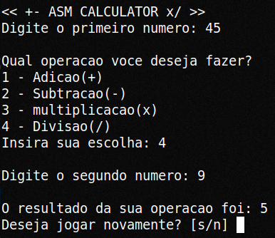

# Assembly Calculator

## Descrição

Este projeto implementa uma calculadora simples em Assembly, capaz de solicitar dois números e uma operação ao usuário. Ele realiza a operação escolhida e exibe o resultado na tela. A calculadora é escrita para sistemas que utilizam a arquitetura x86_64 e utiliza chamadas de sistema do Linux.

